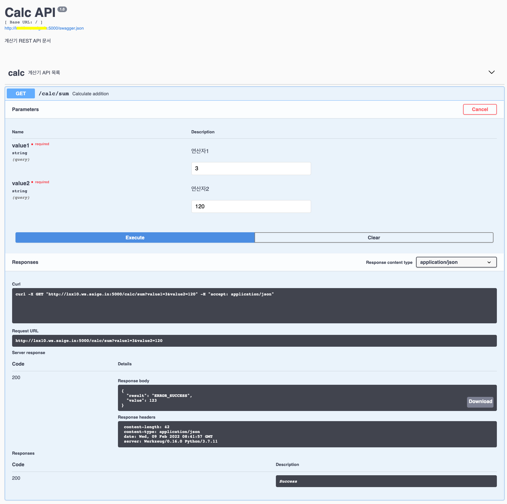

# flask restplus test

* 참조
  * [nurilab](https://nurilab.github.io/2020/04/19/we_do_swagger/)


## Run

```console
python nurilab.py
```

## browser

* go to
    ```
    0.0.0.0:5000
    ```

## How it looks

